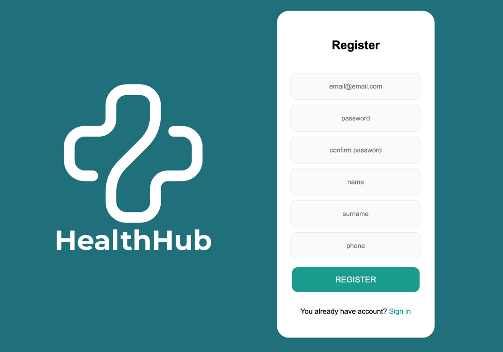

# Helthub 

## Table of Contents

- [Introduction](#introduction)
- [Features](#features)
- [Installation](#installation)
- [Technologies](#technologies)
- [Database Diagram](#database-diagram)


## Introduction

Helthub is web app for managing work of clinics. It allows patient to book visits without leaving home or trying to call in the clinic for hours. It's purpose is to streamline the process of scheduling medical visits. App has two types of users: Patient and Doctor, Doctor can create and manage potential visits, patient can get an appontment and check scheduled apoointments.




## Features

- Reserving visits in clinic
- Monitoring your visits
- Managing visits by doctor

## Installation

Pre-requisites:
- docker installed

Run the following commands in the root directory of the project:

```docker compose up```

Or if you want to run it in the background:

```docker compose up -d```

## Technologies

- Frontend
    - HTML 5
    - CSS 3
    - vanilla Javascript
- Backend 
    - PHP 8
- Database
    - PostgreSQL
- Web server
    - Nginx
- Containerization
    - Docker

## Database Diagram


